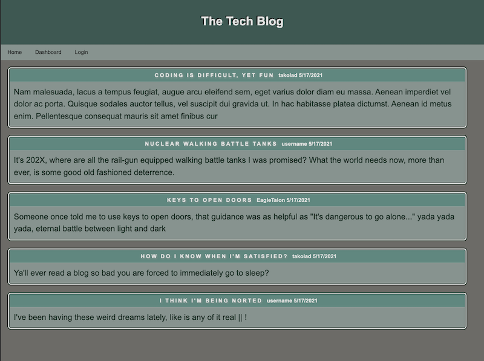

# tech-blog

## Description

    A CMS-style blog site for developers to blog posts and comment
    on other developers' posts. The app will follow the MVC paradigm
    in structure using Handlebars.js for templating, Sequelize as ORM,
    and express-session for authentication.

## Screenshots

## Links

[Site Repo](https://github.com/takolad/tech-blog)
[Deployed Site](https://lit-castle-83748.herokuapp.com/)
